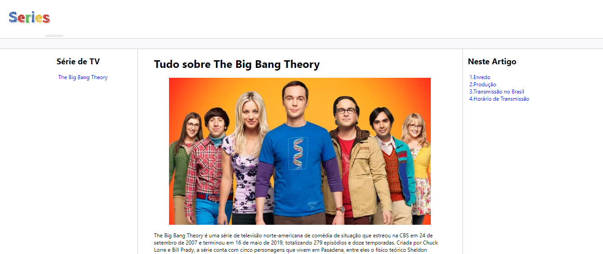

# Módulo 3 - Trilha HTML

**Título:** Recriando Wikipedia, com um layout melhor :)

## Objetivo
Este desafio consiste em treinar você com relação a estrutura do site, e também aplicar conhecimentos adiquiridos sobre semântica e acessibilidade.

## Desafio
Neste repositório tem uma estrutura básica já pré-montada de um layout simples com um pouco de CSS aplicado. Apenas para deixar mais apresentável.

Fiquem a vontade para criar da forma que desejarem, e sobre os temas que quiserem. O intuito aqui é divertir, e ao mesmo tempo aprender com o desafio.

Sigam as intruções da chamada do vídeo. Acredito que por lá, ficará mais fácil de entenderem como proceder.

## Links úteis
- [Download do NVDA](https://www.nvaccess.org/download/)
- [Wikipedia](https://pt.wikipedia.org/)

## Resultado

O documento HTML foi criado para apresentar informações detalhadas sobre a série de TV "The Big Bang Theory". A estrutura do código inclui os seguintes elementos principais:

1. **Cabeçalho (head):**
   - Metadados do documento como codificação de caracteres (UTF-8), compatibilidade com o Internet Explorer, e ajuste da largura da página para diferentes dispositivos.
   - Título da página.
   - Link para um arquivo CSS externo para estilização.

2. **Corpo (body):**
   - **Divisão de Logo:** Contém a logo da página.
   - **Barra de Navegação:** Uma barra simples abaixo do logo.
   - **Conteúdo Principal:**
     - **Barra Lateral (sidebar):** Lista de séries de TV com um link.
     - **Seção Principal (main):** Informações detalhadas sobre "The Big Bang Theory", incluindo texto e imagens.
     - **Tabela de Horários:** Exibe horários de transmissão da série em diferentes serviços.
   - **Ancoragem (anchors):** Links de navegação para diferentes seções do artigo.
   - **Rodapé (footer):** Espaço reservado para o rodapé da página (atualmente vazio).

### Tecnologias Utilizadas

- **HTML5:** Estruturação do conteúdo.
- **CSS (referenciado externamente):** Estilização da página.
- **Imagens:** Uso de imagens para logo e conteúdo visual.

